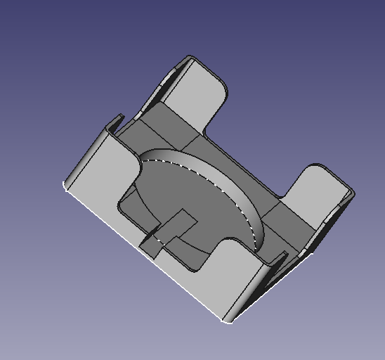
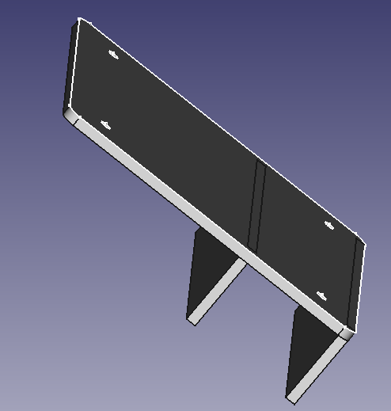

# Tonie Box charger and station

The main goal was to mount our toniebox onto the bed-frame so we can use it for bedtime. Later I wanted to see how hard it was to create a 9V USB-C charger
instead of the included factory charger. I haven't received the board yet, so can't confirm if it works but will update the repo once I have a working version.

The 3D model consists of 2 parts and can be found in the `/3dPrinting` folder. You will have to get some m2 insets if you want to screw them together and most
likely adjust the spacing for the `bed-attachemnt` part so it fits your bed.

